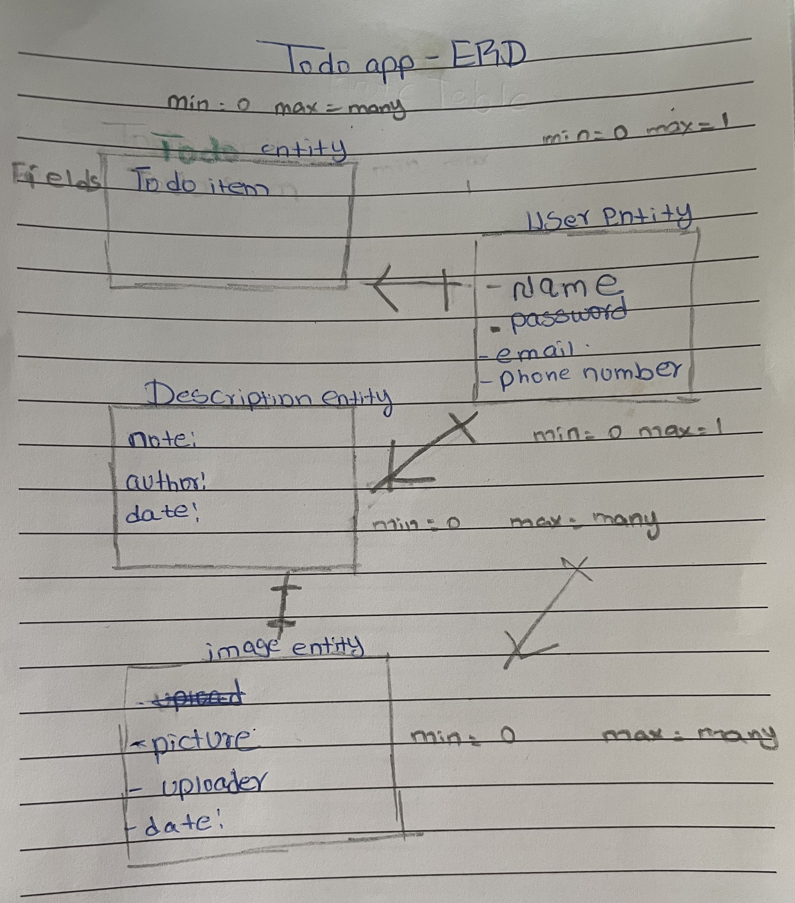
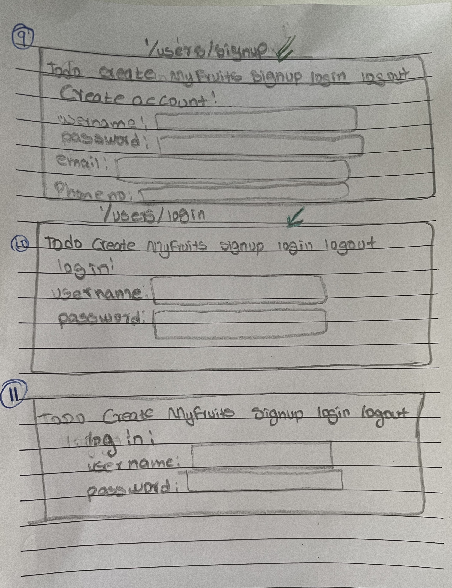

# ONEPLACE

ONEPLACE is a fullstack application, built by utilizing technologies such as JavaScript, Mongoose, Mongodb, liquid template language, node.js, and express.js.

Link to deployed version of the project: https://morning-water-2618.herokuapp.com/todos

## Installation
1. Fork and clone this repository `https://github.com/mmengi18/Project-2-TODO-APP`
1. cd into `project0-2-TODO-APP` directory.
1. Install dependencies with `npm install`.
1. Run `code .` to open visual studio code.
1. Create `.env` file inside the root directory.
1. Run the development server with `npm start`.

## USER STORIES

User stories: (`As a user.....`)
- Create/Post a todo item
    - new schema to see the data structure of the documents
    - model - to take the schema and create an instance
    - a post route to create a new todo item
    - a redirect route to show created todo items
- View all todo items
    - find all todo items inside collection
    - return/show all todo items
- view single todo item
    - inside the todo collection find one document with an id or name 
    - return/show the returned todo items
-Update/Post single todo item Markdown Preview 
    - find a todo item with an id /name
    - when found update that single item
    -  a redirect route to return/ show the updated item 
- Delete all todo items
    - find all todo items in collection 
    - delete all items 
    - send a success message that it was successfully deleted 
- Delete a single todo item
    - find the single item with an id
    - delete that todo item 
    - send a success message
- Delete todo items a week after they were created
    - find all todo items in collection - timestamp crated
    - delete all fruits that meet criteria
    - send a success message

## WIRE FRAMES

 

### Included Routes

This template comes with a handful of front-end routes that display
different components for user actions.

| Verb         | EndPoint | 
|------------------|-------------------|
| `get`       | `users/Signup`    |
| `get`       | `/Todo`    |
|`get`  | `/users/login`  |
| `get`   | `/Todo/mine`   | 
| `get`   | `/Todo/signup`   | 
| `post`   | `/Todo/newitem`   | 
| `get`   | `/Todo/edit`   | 
| `put`   | `/Todo/id`   | 
| `delete`   | `/Todo/id`   | 

## Examples:
Take a look at other projects of mine:  https://github.com/mmengi18/Project-1

