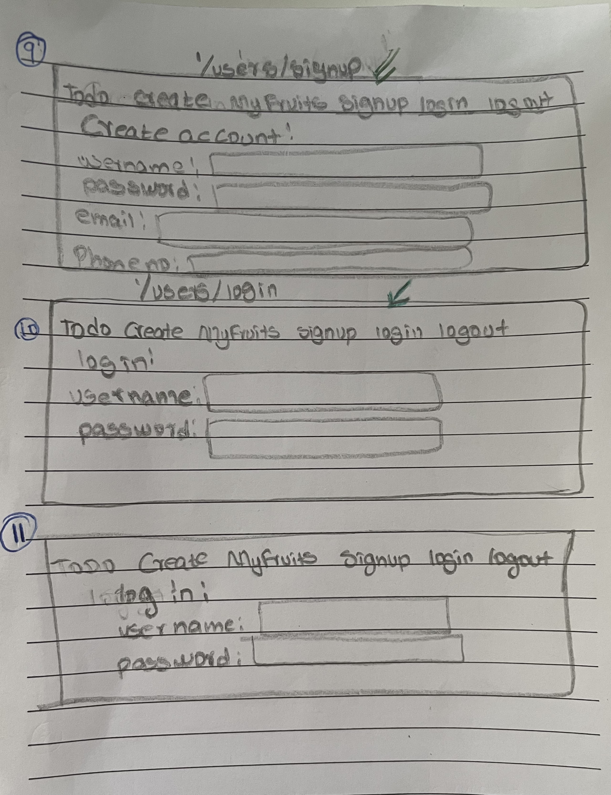

# TODO CRUD APP

USER STORIES

User stories: (`As a user.....`)
- Create/Post a todo item
    - new schema to see the data structure of the documents
    - model - to take the schema and create an instance
    - a post route to create a new todo item
    - a redirect route to show created todo items
- View all todo items
    - find all todo items inside collection
    - return/show all todo items
- view single todo item
    - inside the todo collection find one document with an id or name 
    - return/show the returned todo items
-Update/Post single todo item Markdown Preview 
    - find a todo item with an id /name
    - when found update that single item
    -  a redirect route to return/ show the updated item 
- Delete all todo items
    - find all todo items in collection 
    - delete all items 
    - send a success message that it was successfully deleted 
- Delete a single todo item
    - find the single item with an id
    - delete that todo item 
    - send a success message
- Delete todo items a week after they were created
    - find all todo items in collection - timestamp crated
    - delete all fruits that meet criteria
    - send a success message
    
WIRE FRAMES

ROUTE TABLES

